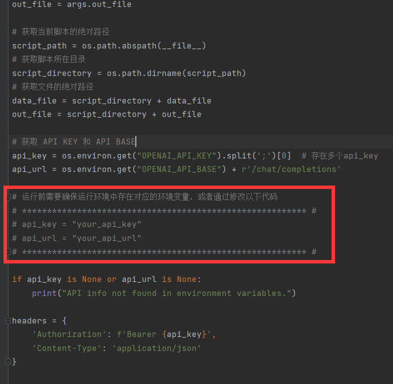
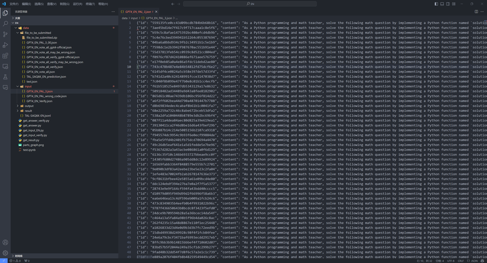

## 核心方法
核心思路：利用 LLM 生成代码，并由外部代码解释器运行得到结果。通过 LLM 生成的 verify 代码验证答案准确性。最终再由多次采样结合自我验证动态投票，得到准确的数学推理结果。


**prompt设计**：PoT few-shot

**0.** 基于网页端GPT-4爬虫、纯自然语言（NL）few-shot CoT prompt，获取若干组解答（这一步的数据依然可以为后面的步骤利用，但这一步本身在我们的方案中是不需要的）。

**1.** 使用few-shot提供三个解题示例，要求LLM给出需要解答的题目的推理过程。

**2.** 任务描述使用自然语言（NL），而few-shot example则使用代码语言（PL）（PoT）。各种语言中Python效果最好。

**3.** PL推理过程使用外部的代码解释器（code interpreter），计算出最终的数值答案。

**其他策略**：majority vote + verify。

**4.** 重复多次1-4的步骤（在我们的方案中为30次），得到多组答案。

**5.** 重复一次1-3的步骤，但此时让LLM给出用于验算答案的verify函数，依然使用Python。

**6.** 对所有的答案数据，运行verify函数，根据verify的结果调整权重。

**7.** 对上述得到的所有答案进行加权多数表决投票。取票数最高者为投票结果。

**8.** 用网页端GPT-4爬虫处理可信度不高或Python code多次采样仍无法运行的题目，合并8中的答案得到最终的答案。

## 运行方式
**0.** 根据`AAAI_Comp_Code_Track2`路径下的`requirements.txt`安装项目所需的依赖。

```shell
pip install -r "your\path\to\requirements.txt"
```

接着进入`AAAI_Comp_Code_Track2\EN\gpt_4_runnner.py`，修改其中的`api_key`与`api_url`两个变量，替换成运行环境中可使用的值。



**1.** 使用`get_input_EN.py`构造每一个问题的code based prompt文件，通过GPT-4生成python函数，返回answer。相对路径为`EN\data\input\GPT4_EN_PAL_3.json`。

```shell
python "your\path\to\get_input_EN.py"
```


**2.** 使用`get_input_verify.py`构造每一个问题的verify prompt文件，用于GPT-4生成python函数，判断给定结果true or false。生成的文件路径为：`EN\data\output\GPT4_EN_Verify.json`

```shell
python "your\path\to\get_input_verify.py"
```
**3.** 运行`run_script.py`，使用GPT-4 API，输入为构造好的code-based-prompt。相对路径为`data\input\GPT4_EN_PAL_3.json`。获取response，得到python函数。共采样30次，获得30个json文件，例如`data\output\GPT4_EN_PAL_3_00.json`。

```shell
python "your\path\to\run_script.py" [--num NUM] [--max_attempts MAX_APTS] --prompt 0
```
其中，可选参数`--num`表示采样次数，默认为30；可选参数`--max_attempts`表示最大重试次数，默认为5；**必选**参数`--prompt`，取0时获取解答所需的python code，取1时获取验证所需的python code。


**4.** 与第3步中类似地，运行`run_script.py`，使用GPT-4 API，输入为构造好的verify-prompt。相对路径为`data\input\GPT4_EN_Verify.json`。获得response，得到verify函数。共采样一次，得到文件`data\output\GPT4_EN_Verify.json`。可以用于多次采样的结果准确性判断，从而实现动态权重投票。

```shell
python "your\path\to\run_script.py" [--max_attempts MAX_APTS] --prompt 1
```
这一步中的采样次数将固定为1。


**5.** 运行`get_result.py`，将采样得到的30组python函数本地运行，得到30组每个问题的answer。注意程序有时候会出现中止，需要多次运行。

```shell
python "your\path\to\get_result.py"
```


**6.** 运行GPT-4官方爬虫代码，对于难度为3、4的问题进行求解，得到1组每个问题的answer。储存的相对路径为`EN\data\result\GPT-4-Official-EN-all.json`。共十个账号同时爬。


**7.** 运行`get_answer_verify.py`，对所有采样得到的结果进行投票，其中GPT4-Official的权重 > code based的权重 > text baed的权重。（具体权重需要调参）根据verify判断结果，动态赋予权重，选取票数最高的最为最终答案。运行后得到两个文件，一是最终结果`EN\data\file_to_be_submitted\GPT4_EN_vote_all_verify.json`，二是每一个结果对应的票数`EN\data\file_to_be_submitted\GPT4_EN_vote_all_verify_may_be_wrong.json`。我们对同一个问题统计30多次采样的不同答案的票数，若最高的票数的数值较低，说明该答案可信度不高。

```shell
python "your\path\to\get_answer_verify.py"
```


**8.** GPT-4网页端爬虫，主要是网页端内部集成了代码解释器，并且可以运行，因此更容易生成准确的代码。运行方法为在`GPT-4_Official_Scraper`路径下，运行`run_script.py`。需要填写十个GPT-4账号和密码。

